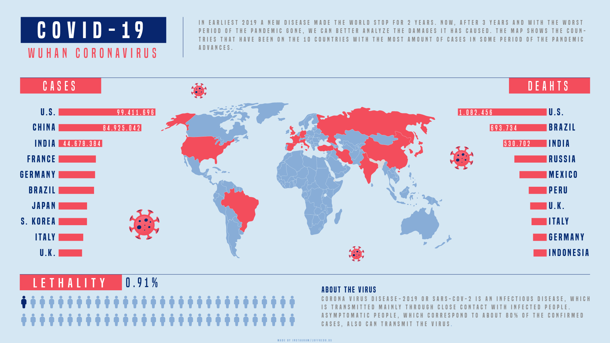

# Estudo atualizado sobre COVID-19 no Brasil e no mundo

 _Click [here](https://github.com/raffaloffredo/covid_2023) to English-EN_   
 

  

 

## Sobre o projeto
Esse é um estudo completo que teve por objetivo analisar os dados sobre COVID-19 no Brasil e no mundo com o objetivo de fazer um levantamento estatístico da situação da doença para auxiliar na divulgação e no entendimento desse assunto na sociedade.

* **[Código](https://github.com/raffaloffredo/covid_2023_portuguese/blob/main/%5BLoffredo_DS%5D_Panorama_do_COVID_19_no_Brasil_e_no_mundo.ipynb)**
* **[Artigo Completo](https://medium.com/@loffredo.ds/ciência-de-dados-aplicada-estudo-sobre-o-covid-19-no-brasil-e-no-mundo-e4a8996a75ab)**
* **[Artigo Resumido (Resultados)](https://medium.com/@loffredo.ds/ciência-de-dados-aplicada-estudo-sobre-o-covid-19-no-brasil-e-no-mundo-e4a8996a75ab)**
 

## Material Extra
_(disponíveis apenas em inglês)_

* Clique [aqui](https://www.youtube.com/watch?v=6DQCzydiCQ8) para ver o gráfico animado que foi gerado nesse estudo
* Infográfico

  

 

## Outros projetos

Análise Explaratória de Dados
* **[Airbnb New York](https://github.com/raffaloffredo/airbnb_new_york_portuguese)**
 

 ## Contatos

  
  
  
  
  

